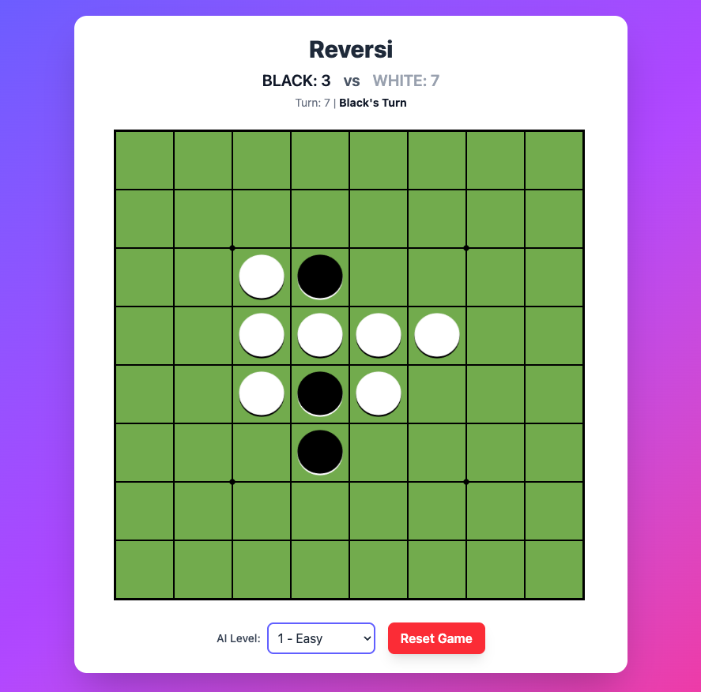
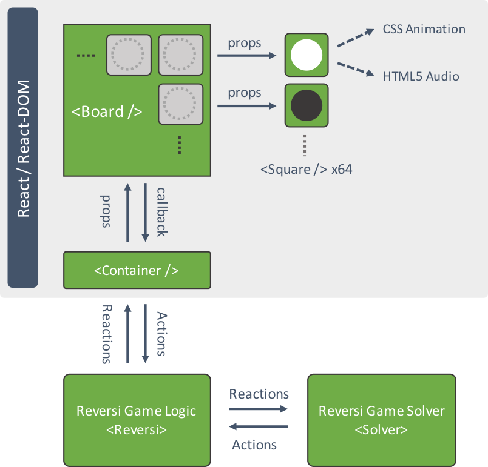
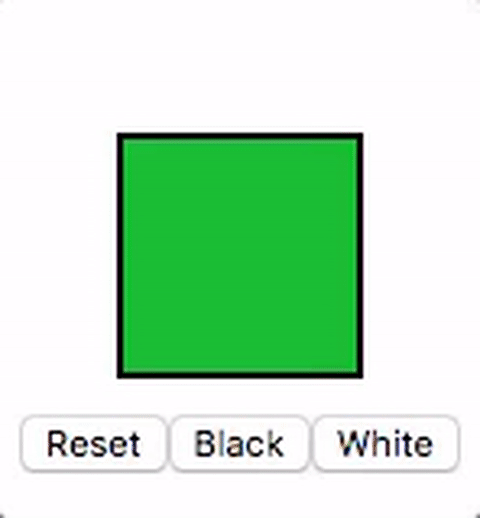

# reversi-react

<p align="center">
  
</p>
An attempt to create an example React application something other than Todo app. In this project, we are going to implement [the Reversi game](https://en.wikipedia.org/wiki/Reversi) using [React.js](https://facebook.github.io/react/) with [TypeScript](http://www.typescriptlang.org/). To demonstrate virtual DOM rendering in action, the app only uses nomrmal DOM elements such that `HTMLDivElement` and `HTMLSpanElement` to with CSS3 animations.

## Design

<p align="center">
  
</p>


### `Reversi` - game engine
The Reversi game engine is implemented as a single Reversi class in TypeScript, managing a 10x10 board with sentinel guards framing an 8x8 playable grid. This design simplifies boundary checks and move validation. Game state handling is optimized for performance: instead of deep-copying the 10x10 board (O(100) per operation), we modify it in-place with placeStone, tracking changes in a lightweight {x, y, prev} array, and revert via undoMove. This reduces memory overhead and speeds up recursive exploration, critical for the AI. The board state, turn tracking, and scoring are encapsulated cleanly, with methods like possibleMoves (O(64 * 8) worst-case) providing fast move generation.

### `Solver` - MinMax-base game solver

The solver leverages a minmax algorithm with alpha-beta pruning for efficient move selection, enhanced by iterative deepening to adapt search depth dynamically (max level + 1, capped by piece count). Move evaluation combines static positional weights (favoring corners), mobility in the early game, and disc differential in the endgame, all computed in evaluateBoard (O(64)). Performance is boosted by a transposition table (capped at 10,000 entries) to cache scores and move ordering based on weight heuristics, reducing the branching factor. For a typical level-3 AI, it evaluates moves within a 400ms time limit, balancing computational cost with strategic depth.

### `<Square />`

Square is a component represents each square of the board. Its responsibility is to render a piece based on value passed as props. It automatically injects respective CSS animations for visual effects and plays HTML5 audio for sound effects.

<p align="left">
  
</p>

```tsx
<div style={{ display: "block", paddingLeft: "40px" }}>
    <Square value={this.state.value} dot={0}/>
</div>
<div style={{ margin: "10px", display: "inline-block" }}>
    <button onClick={this.reset}>Reset</button>
    <button onClick={this.toBlack}>Black</button>
    <button onClick={this.toWhite}>White</button>
</div>
```

### `<Board />`

Board is a component represents Reversi game and provides user interaction by invoking a right callback for mouse and touch events. However, it has zero knowledge on how the Reversi game should be played. It only renders the game based on two dimentional array that describes board passed by game logic (or shared state provided by MobX in this case).

```tsx
<Board values={this.state.value} onClickSquare={this.handleClick} />
```

## How to build

```bash
# Install dependencies
npm install

# Run development server
npm run dev

# Build for production
npm run build

# Preview production build
npm run preview
```

## Deployment

This project is automatically deployed to GitHub Pages using GitHub Actions. When changes are pushed to the `main` branch, the CI/CD pipeline will:

1. Build the project
2. Deploy it to GitHub Pages

You can access the live version at: https://shuntksh.github.io/reversi-react/
